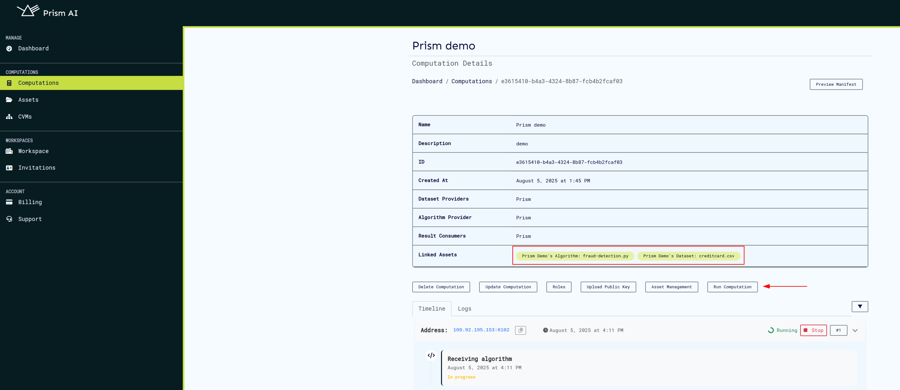

# Computation Assets Overview

Computation assets on Prism provide a convenient way to manage essential computational resources including datasets and algorithms. They can also be associated with or unlinked from a computation.

An important distinction is that computation assets contain file samples of the algorithm or dataset, providing collaborators in a computation with a guide on what the actual files will resemble. These samples are **not** the actual files sent to the computation manifest when uploading via the CLI. For this reason, the actual file’s checksum is required during asset creation.

A single asset can be used in multiple computations (one-to-many relationship), and a computation can be linked to several assets.

## Asset Usage

### 1. **Creating a New Asset**

To create a new asset:

1. Navigate to the **Assets** page.
2. Click the **New Asset** button to open the asset creation modal.

   

The only mandatory fields during asset creation are:

- **File Checksum**: The checksum of the actual file (not the sample), get more information on checksum [here](https://docs.cocos.ultraviolet.rs/cli/#file-hash).

- **Asset Description**: A brief summary of what the asset represents.

The **File Name** field is optional. If provided, it will be verified when asset is uploaded on computation run.

Once created, the asset will appear in the asset list, where you can perform further actions such as downloading the asset or associating it with a computation.

**Note**: The file sample uploaded should not exceed 10 MB in size.

### 2. **Associating an Asset with a Computation**

To associate an asset with a computation, the user must first be added as a **provider** to that computation. An algorithm provider can only link assets of type **algorithm** to computations where they have been added as a provider.

Steps for association:

1. Ensure the computation has been created and the user has been added to it.
2. Click the **Associate** button on the asset.
3. In the search bar, search for the computation to associate the asset with.

   

4. Once the correct computation is found, select it and click **Associate**.

   

Multiple computations can be linked to a single asset. All associated computations will be listed as pills in the computation(s) section.

To **unlink** an asset from a computation, click the **Unlink** button next to the computation you wish to de-associate from the asset.

### 3. **Viewing and Downloading Asset Samples**

If an asset sample has been uploaded, users can either view it directly on Prism or download it for inspection later. This can be done by clicking the asset name or the **View** button in the assets list.

### 4. **Viewing a computation's assets**

To view assets associated to a computation, click the **Asset Management** button which opens the assets page containing the computation's assets.

On the computation assets page, invited collabotors can view and manage all assets associated to a computation.

### 5. **Running a Computation**

Once all assets have been successfully associated with a computation, they will be listed within the computation’s structure. At this point, the user is required to upload their **public keys** to proceed.

After the public keys and other necessary requirements have been provided, the computation can be executed. During execution, the computation service will retrieve the associated assets from the database and add them to the computation manifest, which is then sent to the backend.
