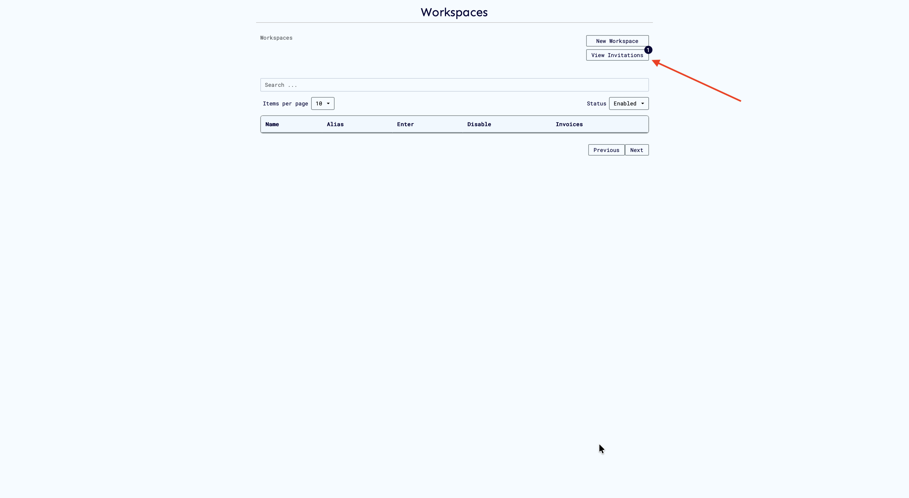
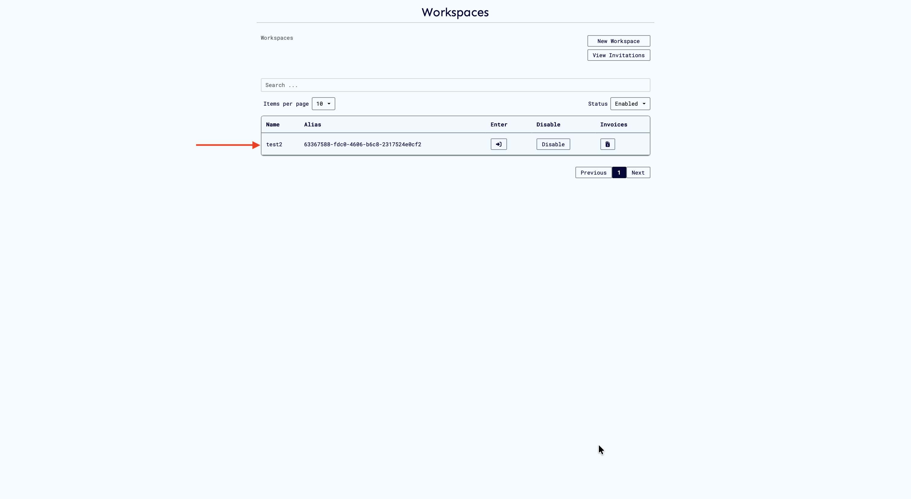

# Invitations

## Overview

Workspace invitations and roles are closely connected. Before you can invite someone to your workspace, you need to understand roles—because every invitation assigns the invited user to a specific role that determines their permissions. You can learn more about roles [here](./workspace-roles.md)

Think of it this way:

1. **First**, you define what roles exist in your workspace and what each role can do
2. **Then**, you invite users and assign them to these roles
3. **Finally**, invited users accept and gain access based on their assigned role

This guide walks through both concepts to help you effectively manage workspace access.

> **Important:** Prism invitations work only for users who are already registered on Prism. Users must create an account before they can receive and accept workspace invitations.

## Understanding Workspace Roles

Roles are the foundation of workspace invitations. When you invite someone, you're essentially saying "join my workspace with these specific permissions." Let's understand what roles are available and how to create custom ones.

### How Roles Work

A workspace has users assigned to different roles that control what they can access and do. Each role is a collection of permissions that determines exactly what actions a user can perform.

### The Admin Role

Every workspace comes with a built-in **Admin** role that has full privileges—complete control over workspace settings, computations, assets, invitations, and role management. The workspace creator is automatically assigned this role.

Here are the permissions included in the Admin role:

- `update` — Modify workspace settings
- `read` — View workspace information
- `delete` — Delete workspace resources
- `enable` / `disable` — Control workspace features
- `manage_role` — Create and modify roles
- `add_role_users` / `remove_role_users` — Assign users to roles
- `view_role_users` — See who has which roles
- `create_cvms` / `remove_cvms` — Manage Confidential VMs
- `create_computation` — Set up new computations

This comprehensive set of permissions gives admins complete control over the workspace—which is exactly what you need as a workspace creator, but often too much access for other team members you'll invite.

### Why Custom Roles Matter for Invitations

However, not everyone you invite needs full administrative access. When inviting team members, you'll typically want to assign them roles with more specific, limited permissions. For example:

- A data scientist you invite should be able to create and run computations but shouldn't manage billing
- An auditor you invite needs read-only access to review computations
- An external partner you invite should only access specific projects

This is where custom roles become essential for your invitation workflow.

### Viewing Available Roles

Navigate to the **Workspace** page to view all roles and their permissions:

Each role defines a specific set of permissions that determine what users can do within the workspace. Prism provides default roles, but you have full flexibility to create and customize roles to match your exact needs.

Currently, we only have the admin role. We will work on creating a custom role that we can assign and invite users in the next step.

### Creating Custom Roles

You can create custom roles tailored to your workspace requirements:

1. Navigate to **Roles** in your workspace
2. Click **Create Role**
3. Define your custom role:

   - **Role Name** — e.g., "Computation Manager","Data Analyst", "ML Engineer", "Auditor"

4. Add specific permissions as needed:

   - **Workspace management** — View, edit, delete workspace settings
   - **Computation access** — Create, run, view, or manage computations
   - **Asset management** — Upload, link, modify algorithms and datasets
   - **Invitation controls** — Send and manage workspace invitations
   - **Role administration** — Create, assign, or modify roles
   - **Billing access** — View or manage workspace billing
   - **CVM management** — Provision or configure Confidential VMs

   

Each permission can be set independently, giving you precise control. For instance, you might grant someone the ability to run computations but not create new ones, or allow them to view assets without uploading new ones.

The new role will be created and added to the list of roles for the workspace.

## Inviting Users to Your Workspace

Once you've set up the appropriate roles, you can invite users to collaborate in your workspace.

### Overview

Workspace administrators can invite members to collaborate within their workspace. Invited users receive notifications and can choose to accept or decline invitations.

> **Important:** Prism invitations work only for users who are already registered on Prism. Users must create an account before they can receive and accept workspace invitations.

## Steps to Invite a User

1. Open the **Invitations** section from the sidebar

The invitations page displays:

- **All pending invitations** — Users who haven't responded yet
- **Invitation status** — Pending, Accepted, or Rejected
- **Action buttons** — Options to resend or delete invitations

If you haven't sent any invitations yet, you'll see an empty state:

2. Click **Invite User**

3. Enter the user's details:

   - Username
   - Assigned role (e.g., Admin, Member, Viewer)

4. Click **Send Invitation**. The invitation will appear in your Invitations table with a **Pending** status.

Each invitation shows:

- **Invited User** — Name
- **Invited By** —Person who sent the invite
- **Workspace** — Destination workspace name
- **Role** — Access level assigned

There are drop down menus to view:

- **Status** — Current state (Pending, Accepted, Declined)
- **Actions** — Options to manage the invitation

> **Note:** You can only invite users who are already registered on Prism. The invitation system uses existing Prism member accounts.

## Receiving and Viewing Invitations

When you're invited to a workspace, you'll see a notification badge on the **Workspaces** page.

### How to View Your Invitations

1. Navigate to **Workspaces**
2. Click **View Invitations**
3. A modal displays all pending invitations with:
   - Workspace name
   - Your assigned role
   - Who invited you
   - When you were invited
   - **Accept** and **Decline** buttons

## Responding to Invitations

### Accepting an Invitation

1. Click **Accept** in the invitation modal
2. You'll be added to the workspace immediately

3. The invitation status changes to **Accepted**
4. You can now access the workspace with your assigned role

### Rejected Invitations

When a user declines an invitation, it appears in the rejected invitations view:

You can choose to:

- **Resend the invitation** if circumstances have changed
- **Delete the invitation** to remove it from your list

## Resending Invitations

If an invitation was declined or if the user wants to reconsider, you can resend it.

### Steps to Resend

1. Locate the invitation in your invitations list
2. Click the **Resend** button

It will open a modal to reinvite the user:

3. Confirm the action

The user will receive a new invitation notification, and the invitation status will reset to **Pending**.

## Deleting Invitations

Remove unwanted or outdated invitations from your workspace.

### Steps to Delete

1. Find the invitation you want to remove
2. Click the **Delete** button

3. Confirm the deletion in the popup

The invitation will be deleted and will be removed from the list.

**What happens when you delete:**

- The invitation is permanently removed
- The user can no longer accept this invitation
- You can send a new invitation to the same user later if needed

## Quick Reference

| Step | Action                     | Result                                         |
|------|----------------------------|------------------------------------------------|
| 1    | Admin sends invitation     | Status: **Pending**                            |
| 2    | User receives notification | Badge appears on Workspaces page               |
| 3    | User views invitation      | Modal displays invitation details              |
| 4    | User accepts/declines      | Status updates to **Accepted** or **Rejected** |
| 5    | Admin reviews responses    | Can filter by status, resend, or delete        |
