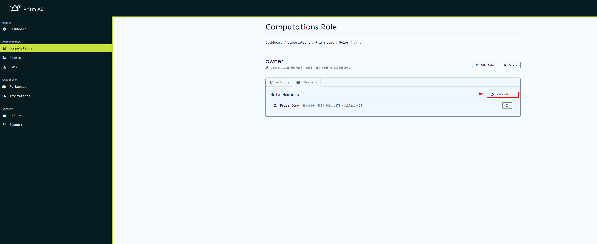

# Roles

## Computation Roles

Computation roles are used to manage user actions to a computation. On service start, builtin roles are created with their associated actions which can be assigned to a user on a particular computation. These builtin roles can be updated, deleted, and new ones added.

The following builtin roles are created on service initialization:

| Built-in Role     | Actions                        |
| ----------------- | ------------------------------ |
| Owner             | view, edit, run, administrator |
| AlgorithmProvider | view, algo_provider            |
| DatasetProvider   | view, dataset_provider         |
| ResultConsumer    | view, result_consumer          |
| Viewer            | view                           |
| Editor            | view, edit                     |
| Runner            | view, run                      |

Here’s an enhanced version of your Role Management documentation with additional explanations and clarity:

## Role Management

### Overview

Role management is a critical component of access control in computations. Each role defines a set of actions a user is permitted to perform, ensuring that users have only the necessary actions for their responsibilities.

A key constraint in the role system is that **a user can only belong to a single role at a time**. If multiple actions from different roles are required (e.g., both **algo_provider** and **dataset_provider**), an existing builtin role can be updated to include these actions, or a **[new custom role](#Creating a Role)** can be created with those combined actions.

Builtin roles provide the most basic roles with single actions that can be updated or added depending on the user's requirements.

### Role Purpose in Computation Manifest

Roles are essential in governing who can interact with a computation and how. In the computation manifest, assigned roles determine access to various resources, such as datasets, algorithms, and execution actions. Each role is mapped to a set of predefined actions that enforce security and operational boundaries within a computation.

### Accessing Role Management

To manage roles, follow these steps:

1. Navigate to the **Computations** page.
2. Click the **New Computation** button to create a computation.
3. After creation, open the computation's **Details** page.
4. Click the **Roles** button to manage user roles.

Clicking the **Roles** button will display all predefined built-in roles and their associated actions.

### Built-in Roles and Their Actions

The system provides predefined **built-in roles**, each granting specific access levels. The available built-in roles and their associated actions are:

| Built-in Role         | Actions                        | Description                                                               |
| --------------------- | ------------------------------ | ------------------------------------------------------------------------- |
| **Owner**             | view, edit, run, administrator | Full control over the computation, including modifying roles and actions. |
| **AlgorithmProvider** | view, algo_provider            | Provides algorithms but cannot edit or run computations.                  |
| **DatasetProvider**   | view, dataset_provider         | Provides datasets but cannot edit or execute computations.                |
| **ResultConsumer**    | view, result_consumer          | Can view results but cannot modify or execute computations.               |
| **Viewer**            | view                           | Read-only access.                                                         |
| **Editor**            | view, edit                     | Can modify computations but cannot execute them.                          |
| **Runner**            | view, run                      | Can execute computations but cannot modify them.                          |

### Explanation of Actions

Each action in a role defines what the user can do:

- **view** – Allows the user to see computation details but not modify them.
- **edit** – Grants the ability to modify computation properties.
- **run** – Enables execution of a computation.
- **administrator** – Provides full control, including role management.
- **algo_provider** – Allows the user to contribute and manage algorithms.
- **dataset_provider** – Allows the user to contribute and manage datasets.
- **result_consumer** – Enables access to computation results.

## Managing Roles

### Creating a Role

To create a role, the following steps can be followed.

1. Click the **Create Role** button.
2. Define the role name and select the required actions.
3. Save the role to make it available for assignment.

### Updating a Role

Existing roles can be modified if actions need to be adjusted.

1. Click the **Update Role** button next to the role.
2. Modify the role’s name or actions.
3. Save the changes to update the role.

  

### Viewing Role Details

To see details about a role, including its assigned actions and members, click the **View Role** button.

This will display:

- **Role Actions** – The actions assigned to the role.
- **Role Members** – A list of users assigned to this role.

  

## Managing Users in Roles

### Adding a User to a Role

Since a user can only have one role at a time, ensure that the assigned role includes all necessary actions.

1. Click the **Add Members** button.
2. Select users to assign to the role.
3. Confirm the selection.

  

### Removing a User from a Role

To revoke access, remove a user from a role:

1. Navigate to the role’s details page.
2. Locate the user in the **Role Members** section.
3. Click the **Remove** button.

## Deleting a Role

Roles that are no longer needed can be removed. **Note:** Deleting a role will revoke access for all assigned users.

1. Click the **Delete Role** button next to the role.
2. Confirm the deletion.

