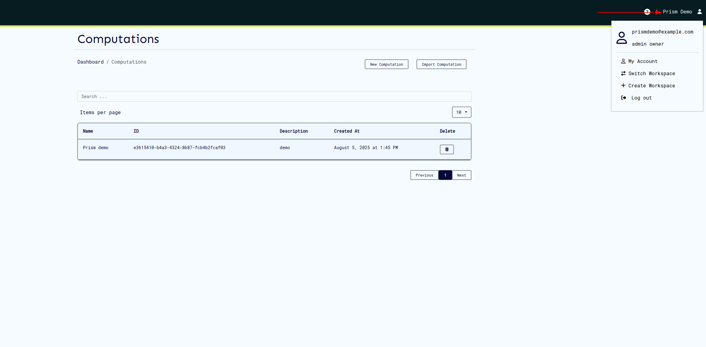
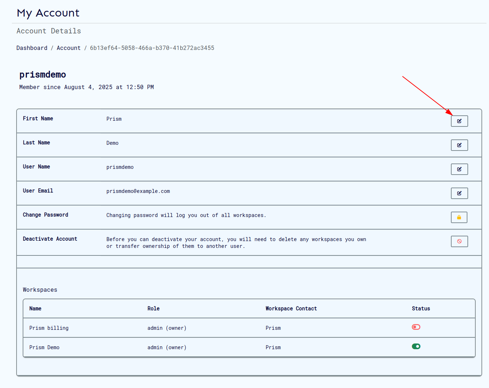

# Users

## Create User

> Identity, which can be email-address (this must be unique as it identifies the user) and secret (password must contain at least 8 characters)

On ui this can be done as follows;

Navigate to the landing page and click the **Register** button:

On the registration form, provide the following required details:

- **Username**
- **Email Address**
- **First and Last Names**
- **Password**
  

## Token management

Issuing and refreshing the user token is done automatically on UI when you log in to your account. This can be done as follows:

1. Navigate to the login page:

   

2. Enter your email and password, and click login.

   This will direct you to the workspaces page at which point you can select the workspace to log in to and proceed with using Prism.

   

## Get User Profile

On the UI this can be done as follows:

- Once logged in, click on your **User Profile** icon located at the top-right corner of the page:
  

- From the dropdown menu, select the **My Account** option. This will redirect you to your **Profile Page**:
  

## Steps to View and Update User Information

### 1. Profile Page Overview

- On the profile page, you can:
  - View a summary of your account details.
  - Access options to **update** your information or **deactivate** your account.

### 2. Updating User Details

To modify your information, click the **Update** icon on the profile page:

On the resulting update page, you can edit any of the following fields as needed:

- Username
- Email Address
- First and Last Names
- Password
  

### 3. Disabling a User

- To deactivate your account, you must first manage any associated entities:
  - Delete all associated entities, OR
  - Transfer ownership of these entities to another registered user.

> **Note:** Once all associated entities are resolved, you can proceed with account deactivation through the options provided on the profile page.
